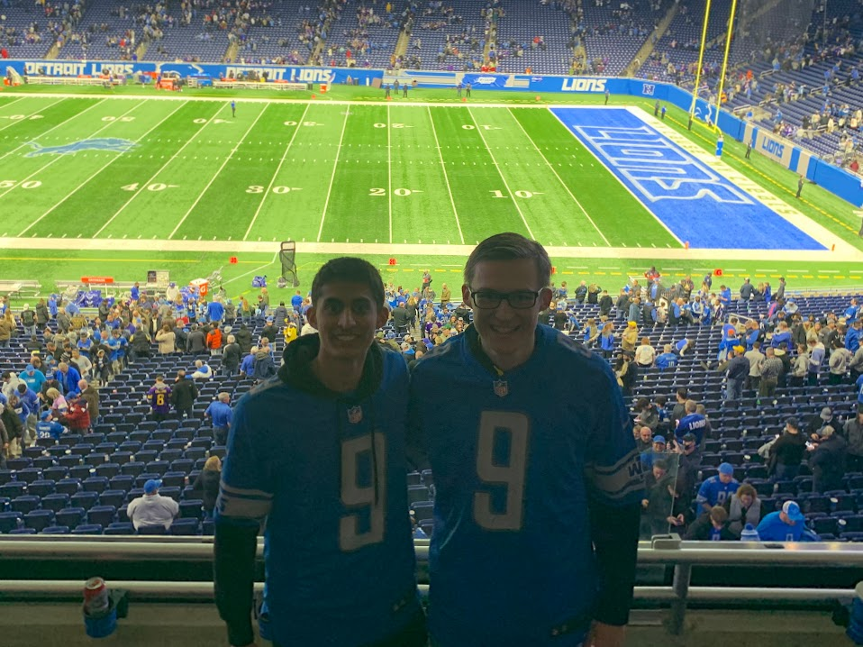

class: middle, center

```{r xaringan-themer, include=FALSE, warning=FALSE}
library(xaringanthemer)
style_mono_accent(base_color = "#0F9D58")
```

class: top, left

# Introduction

- My name is __Tej Seth__ 
  - Currently a Junior at the University of Michigan
  - Majoring in Information Analysis and minoring in Applied Statistics
  - Can be found at [@tejfbanalytics](https://twitter.com/tejfbanalytics)
  - Last Summer: Research & Development Intern at Pro Football Focus
  - This Summer: Risk & Financial Advisory Analytics at Deloitte

```{r echo=FALSE, out.height= 300, out.width= 400}

```

---

# How I Got Into Sports Analytics

- Started coding in R when I was a freshman in college
- Wanted to recreate the graphs [@benbbaldwin](https://twitter.com/benbbaldwin) was posting on Twitter
- It started out tough but eventually everything clicked
- The lines of code that changed my life:

```{r install-nflfastR, message=FALSE}
# install.packages("nflfastR")
library(nflfastR)
library(tidyverse)
pbp <- load_pbp(2019)
pbp %>% select(posteam, defteam, down, ydstogo, yards_gained) %>% head()
```

---

# The Next Steps

- Receiving feedback through constructive criticism is huge
  - Easiest avenue for this is by posting on Twitter
  - Coding with other students interested in sports analytics can be very helpful
  - Some people are worried to put their stuff out there but the community is very welcoming
- Any coder can make a graph but can you glean analysis from it?

.pull-left[]

.pull-right[]
  
  
  
  
