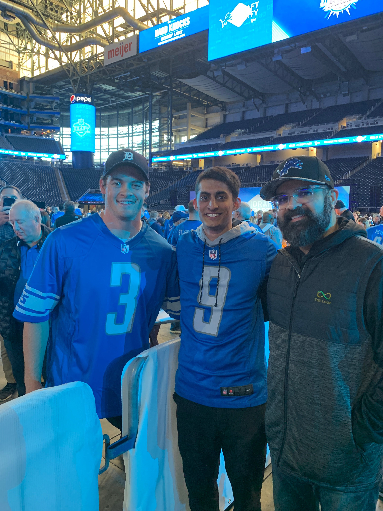

class: middle, center


```{r xaringan-themer, include=FALSE, warning=FALSE}
library(xaringanthemer)
style_mono_accent(base_color = "#F4BB44")
```

class: top, left

## Introduction

- My name is __Tej Seth__ 
  - Currently a Senior at the University of Michigan
  - Majoring in Information Analysis and minoring in Applied Statistics
  - Can be found at [@tejfbanalytics](https://twitter.com/tejfbanalytics)
  - Previous Experience Focus: PFF, Michigan Football
  - Now: Data Scientist at Sumer Sports

```{r echo=FALSE, out.height= 400, out.width= 300,, fig.align='center'}

```

---

## My Sports Analytics Journey

- Whenever I got a baseball card as a kid I always looked at the stats on the back
- Was always a big sports fan, especially of Detroit sports
- High School 
  - Copy and pasted data from Pro Football Reference
  - Made scatter plots on google sheets (would not recommend)
- College
  - Joined a football analytics club
  - Took my first coding class in the winter (in C++)

```{r echo=FALSE, out.height= 300, out.width= 500, fig.align='center'}
knitr::include_graphics("https://www.filmstudybaltimore.com/wp-content/uploads/2020/07/PFR.png")
```

---

## Teaching Myself How to Code

- Started coding as a freshman using R
- Wanted to recreate the graphs [@benbbaldwin](https://twitter.com/benbbaldwin) was posting on Twitter
- It took weeks but eventually everything clicks
- The lines of code that changed everything:

```{r install-nflfastR, warning = FALSE, message= FALSE}
# install.packages("nflfastR")
library(nflfastR)
library(tidyverse)
pbp <- load_pbp(2019)
pbp %>% select(posteam, defteam, down, ydstogo, yards_gained) %>% head()
```

---

## The Next Steps

- Started posting graphs and analysis on Twitter
  - Received a lot of constructive criticism (and some criticism)
- Started stringing together multiple graphs for long-form articles
  - Enjoyed combining data and analysis in one central area
  
```{r echo=FALSE, fig.align='center', fig.height = 200, fig.width= 800}
knitr::include_graphics("https://www.nflfastr.com/reference/figures/card.png")
```

---

## Data Viz Over Time (Bad Example)

```{r echo = FALSE, fig.align='center', out.height = 500, out.width= 700}
knitr::include_graphics("https://mfootballanalyticscom.files.wordpress.com/2019/10/chart1.png")
```

---

## Data Viz Over Time (Good Example)

```{r echo = FALSE, fig.align = 'center', out.height = 500, out.width= 690}
knitr::include_graphics("https://media.pff.com/2022/04/6-draft21-1536x1097.png")
```

---

## Getting Your Name Out There

- Posting articles on a website and graphs on Twitter gets attention
  - Especially when you can reply with a graph you made to a bigger account
- Tweets are *fine* but making connections with people in the industry is one of the best things to do
  - Linkedin
  - Email
  - Twitter Direct Messages
- **Bottom Line: Doing good public work will get you noticed**

```{r echo = FALSE, fig.align = 'center', out.height = 500, out.width= 750}
knitr::include_graphics("https://dca.wharton.upenn.edu/wp-content/uploads/2021/04/NFLBigdata-bowlteam.jpg")
```

---

## My Journey to Pro Football Focus
  1. Got in touch with a current intern there through Twitter DM's
  2. He gave me Eric Eager's email (the Director of Research & Development)
  3. Eric had seen my tweet and articles and knew I liked football and data
  4. Applied to the link that he sent me and told him I applied
  5. Had an interview with him + a screening with HR
  
```{r echo = FALSE, fig.align = 'center', out.height = 200, out.width= 500}
knitr::include_graphics("https://csva.com/wp-content/uploads/2017/03/PFF-logo.png")
```
  
---

## Balancing School and Sports Analytics

- School usually came first because there was a timeline
- Having "weekend" projects to look forward to made schoolwork go by faster
- Doing sports analytics doesn't feel like work because it's sports!

```{r echo = FALSE, fig.align = 'center', out.height = 350, out.width= 600}
knitr::include_graphics("https://media.giphy.com/media/78yQCCyWAGiSpN5qVS/giphy.gif")
```
  
---

## A Process for Generating New Ideas

- Watching a lot of football helps conjure up ideas!
- Look into other sports and see how they are measuring performance
- Start with early data analysis (EDA) on the topic
- Make a simple model to see if the process is there
- Go to an advanced model if needed

```{r making-lm, warning = FALSE, message= FALSE}
library(nflfastR)
library(tidyverse)
library(ranger)

pbp <- load_pbp(2022)
pbp_pass <- pbp %>%
  filter(pass == 1, !is.na(air_yards))

lm_air_yards <- lm(air_yards ~ as.factor(down) + ydstogo + yardline_100, 
                   data = pbp_pass)

rf_air_yards <- ranger(air_yards ~ down + ydstogo + yardline_100,
                       data = pbp_pass)
```
  
---

## Resources & Competitions for Sports Analytics Students

- Tutorials
  - Introduction to nflfastR: https://tinyurl.com/kutztown-nflfastr
  - Youtube: https://tinyurl.com/kutztown-youtube
  - Open Source Football: https://www.opensourcefootball.com/
- Competitions
  - The [Big Data Bowl](https://www.kaggle.com/c/nfl-big-data-bowl-2022)
  - Sports Info Solutions [Football Analytics Challenge](https://github.com/SportsInfoSolutions/AnalyticsChallenge2020)
  - The [Big Data Cup](https://www.stathletes.com/big-data-cup/)
  
```{r echo = FALSE, fig.align = 'center', out.height = 200, out.width= 425}
knitr::include_graphics("https://operations.nfl.com/media/4213/2020-ploenzke-podium.jpg?mode=max&width=995")
```
  
  
---

## The Future of Sports Analytics

- It will be run by students like us!
- Even if you don't decide to go into sports analytics, being able to use tools
like R and/or Python to analyze, visualize and model data is an insanely useful skill
to have
- Analytics in the Pro's
  - the __MLB__ had their "Moneyball" takeover more than a decade ago
  - the __NBA__ just had their "Midrange" revolution
  - the __NFL__ is next as teams start to use tracking data to their advantage
  
```{r echo = FALSE, fig.align = 'center', out.height = 300, out.width= 550}
knitr::include_graphics("https://waydev.co/wp-content/uploads/2020/01/moneyball-git-analytics.jpg")
```

---

## Conclusion

- Always feel free to reach out to me at:
  - Twitter: [@tejfbanalytics](https://twitter.com/tejfbanalytics)
  - Email: tejseth@umich.edu
  - Linkedin: [Tej Seth](https://www.linkedin.com/in/tejseth/)
- Thank you so much for listening to my presentation
- Feel free to ask any questions in the zoom chat or over the mic

```{r echo = FALSE, fig.align = 'center', out.height = 300, out.width= 550}
knitr::include_graphics("https://media.licdn.com/dms/image/C4D12AQHyGyo15py5CQ/article-cover_image-shrink_600_2000/0/1602153854130?e=2147483647&v=beta&t=W4Wdyzfe70g8keEpmX3rWbAMNX3Jf8KFb60BEM8XT20")
```

